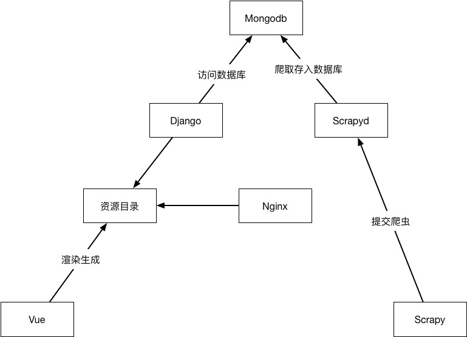

# 概述

## 环境配置
环境依赖
* docker [[安装教程](https://download.daocloud.io/)]
* docker-compose

切换到`/deploy`目录下。
运行 `sh build.sh`即可完成环境的基本构建。
`sh start.sh`运行环境。
网站会在`127.0.0.1:80`打开


## 项目结构说明
```
├── deploy            # 部署文件
└── src               # 源文件
    ├── scrapy        # 爬虫相关
    └── web           # web相关
        ├── dist      # 由vue生成的资源文件
        ├── django    # django 代码
        └── vue       # 环境
            └── code  # vue源代码
```
## 流程说明



